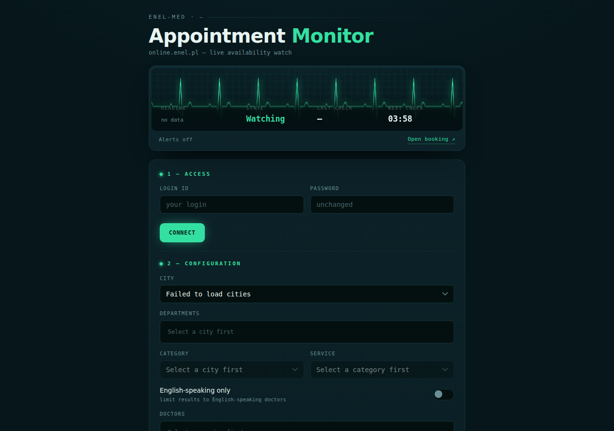

# enel-med-fetcher

A Node.js tool that monitors appointment availability on [online.enel.pl](https://online.enel.pl) for a given service and city. It can run as a **web UI** with a background poller, or as a **terminal script** for a single one-shot check.

---

## Web UI

The web interface gives you a live dashboard with an ECG-style availability trace, cascading dropdowns to configure your search, and email notifications when slots appear.



### Start the server

```bash
npm install
npm start
```

Then open [http://localhost:3000](http://localhost:3000) in your browser.

### Step 1 — Access

Enter your Enel-Med login credentials and click **Connect**. This saves your credentials and loads the cascade selects.

### Step 2 — Configuration

Use the cascade dropdowns to select:

- **City** → **Departments** (multi-select checkboxes) → **Category** → **Service** → **Doctors** (multi-select checkboxes)
- **English-speaking only** — filters for doctors who accept English-speaking patients
- **Search range** — how many weeks ahead to look (1–4 weeks)
- **Check interval** — how often to re-check (minutes; decimals allowed, e.g. `0.5` for 30 s)
- **Skip slots < 1 h away** — ignore appointments starting within the next hour

Click **Save configuration** to apply. The background checker restarts immediately with the new settings.

### Email notifications

Fill in the **Notifications** section with SMTP credentials to receive an email the first time slots become available. A new email is sent only after all slots disappear and new ones reappear (no repeated alerts for the same availability window).

### Deploying

A [`render.yaml`](render.yaml) is included for one-click deployment on [Render](https://render.com). Set the required environment variables (`LOGIN_ID`, `PASSWORD`, …) in the Render dashboard.

---

## Terminal script

For a single check without the server, run the script directly:

```bash
npm run start:script
```

This requires a `.env` file with at least your credentials:

```env
LOGIN_ID=your_login
PASSWORD=your_password
```

Full list of supported environment variables:

| Variable | Default | Description |
|---|---|---|
| `LOGIN_ID` | — | Enel-Med login (required) |
| `PASSWORD` | — | Enel-Med password (required) |
| `CITY_ID` | `1` | City ID (1 = Warszawa) |
| `SERVICE` | `1765` | Service ID |
| `SERVICE_TYPE` | `13` | Service type ID |
| `DEPARTMENTS` | *(all)* | Comma-separated department IDs to filter; leave empty for all |
| `DOCTORS` | *(all)* | Comma-separated doctor IDs to filter; leave empty for all |
| `ENGLISH` | `false` | Set `true` to filter for English-speaking doctors |
| `VISIT_WEEKS` | `2` | How many weeks ahead to search |
| `SKIP_IMMEDIATE` | `true` | Skip appointments within the next hour |
| `INTERVAL_MINUTES` | `5` | (server only) Polling interval in minutes |
| `NOTIFY_EMAIL` | — | (server only) Recipient address for email alerts |
| `SMTP_HOST` | `smtp.gmail.com` | (server only) SMTP host |
| `SMTP_PORT` | `587` | (server only) SMTP port |
| `SMTP_USER` | — | (server only) SMTP username |
| `SMTP_PASS` | — | (server only) SMTP password / app password |

The script prints the number of found appointment slots and exits. To poll continuously from the terminal, use a simple loop:

```bash
while true; do npm run start:script; sleep 300; done
```

---

## Dependencies

- [axios](https://github.com/axios/axios) — HTTP client
- [axios-cookiejar-support](https://github.com/3846masa/axios-cookiejar-support) — cookie jar for axios
- [cheerio](https://cheerio.js.org/) — HTML parsing (CSRF tokens, result scraping)
- [tough-cookie](https://github.com/salesforce/tough-cookie) — cookie management
- [express](https://expressjs.com/) — web server (UI mode only)
- [nodemailer](https://nodemailer.com/) — email notifications (UI mode only)
